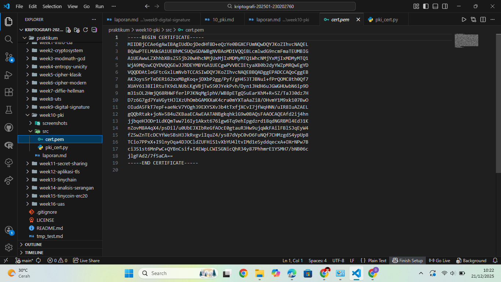

# Laporan Praktikum Kriptografi
Minggu ke-: 10  
Topik: Public Key Infrastructure (PKI & Certificate Authority)  
Nama: Julian Aji Pratama  
NIM: 230202760  
Kelas: 5IKRB  

---

## 1. Tujuan
1. Membuat sertifikat digital sederhana.  
2. Menjelaskan peran Certificate Authority (CA) dalam sistem PKI.  
3. Mengevaluasi fungsi PKI dalam komunikasi aman (contoh: HTTPS, TLS).

---

## 2. Dasar Teori
Public Key Infrastructure (PKI) adalah sistem yang digunakan untuk mengelola kunci publik dan sertifikat digital guna menjamin keamanan komunikasi. PKI memungkinkan pihak yang berkomunikasi untuk memverifikasi identitas satu sama lain serta memastikan integritas data yang dikirimkan.

Certificate Authority (CA) merupakan entitas tepercaya yang bertugas menerbitkan dan menandatangani sertifikat digital. Dalam sistem PKI modern, browser dan sistem operasi menyimpan daftar CA tepercaya. Sertifikat yang diterbitkan CA digunakan secara luas dalam HTTPS, email aman, dan tanda tangan digital. Sertifikat self-signed hanya cocok untuk keperluan pembelajaran atau pengujian karena tidak divalidasi oleh CA resmi.

---

## 3. Alat dan Bahan
- Python 3.12.10  
- Visual Studio Code / editor lain  
- Git dan akun GitHub  
- Library tambahan (cryptography pyopenssl)

---

## 4. Langkah Percobaan
(Tuliskan langkah yang dilakukan sesuai instruksi.  
Contoh format:
1. Membuat file `pki_cert.py` di folder `praktikum/week10-pki/src/`.
2. Menyalin kode program dari panduan praktikum.
3. Menjalankan program dengan perintah `python pki_cert.py`.)

---

## 5. Source Code
(Salin kode program utama yang dibuat atau dimodifikasi.  
Gunakan blok kode:

```python
from cryptography import x509
from cryptography.x509.oid import NameOID
from cryptography.hazmat.primitives import hashes, serialization
from cryptography.hazmat.primitives.asymmetric import rsa
from datetime import datetime, timedelta

# Generate key pair
key = rsa.generate_private_key(public_exponent=65537, key_size=2048)

# Buat subject & issuer (CA sederhana = self-signed)
subject = issuer = x509.Name([
    x509.NameAttribute(NameOID.COUNTRY_NAME, u"ID"),
    x509.NameAttribute(NameOID.ORGANIZATION_NAME, u"UPB Kriptografi"),
    x509.NameAttribute(NameOID.COMMON_NAME, u"example.com"),
])

# Buat sertifikat
cert = (
    x509.CertificateBuilder()
    .subject_name(subject)
    .issuer_name(issuer)
    .public_key(key.public_key())
    .serial_number(x509.random_serial_number())
    .not_valid_before(datetime.utcnow())
    .not_valid_after(datetime.utcnow() + timedelta(days=365))
    .sign(key, hashes.SHA256())
)

# Simpan sertifikat
with open("cert.pem", "wb") as f:
    f.write(cert.public_bytes(serialization.Encoding.PEM))

print("Sertifikat digital berhasil dibuat: cert.pem")
```
)

---

## 6. Hasil dan Pembahasan
(- Lampirkan screenshot hasil eksekusi program (taruh di folder `screenshots/`).  
- Berikan tabel atau ringkasan hasil uji jika diperlukan.  
- Jelaskan apakah hasil sesuai ekspektasi.  
- Bahas error (jika ada) dan solusinya. 

Hasil eksekusi program Caesar Cipher:


)

---

## 7. Jawaban Pertanyaan
- Pertanyaan 1: Apa fungsi utama Certificate Authority (CA)?  
  CA berfungsi untuk memverifikasi identitas pemilik sertifikat dan menerbitkan sertifikat digital yang dapat dipercaya oleh sistem dan pengguna.
- Pertanyaan 2: Mengapa self-signed certificate tidak cukup untuk sistem produksi?  
  Karena tidak diverifikasi oleh CA tepercaya, sehingga rentan terhadap penyamaran identitas dan tidak dipercaya oleh browser atau klien.
- Pertanyaan 3: Bagaimana PKI mencegah serangan MITM dalam komunikasi TLS/HTTPS?  
  PKI memastikan bahwa public key server telah diverifikasi oleh CA. Jika sertifikat tidak valid atau palsu, browser akan menampilkan peringatan dan koneksi tidak dianggap aman.

---

## 8. Kesimpulan
Praktikum ini menunjukkan bahwa PKI dan CA memiliki peran penting dalam komunikasi aman. Sertifikat digital memungkinkan verifikasi identitas dan integritas data. Namun, sertifikat self-signed hanya cocok untuk pembelajaran dan pengujian, sedangkan sistem produksi memerlukan CA tepercaya.

---

## 9. Daftar Pustaka
(Cantumkan referensi yang digunakan.  
Contoh:  
- Katz, J., & Lindell, Y. *Introduction to Modern Cryptography*.  
- Stallings, W. *Cryptography and Network Security*.  )

---

## 10. Commit Log
(Tuliskan bukti commit Git yang relevan.  
Contoh:
```
commit abc12345
Author: Nama Mahasiswa <email>
Date:   2025-09-20

    week2-cryptosystem: implementasi Caesar Cipher dan laporan )
```