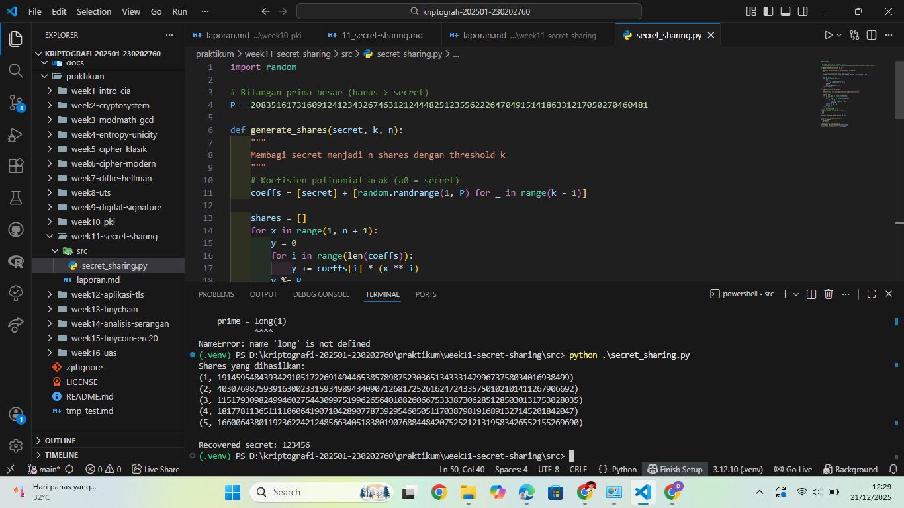

# Laporan Praktikum Kriptografi
Minggu ke-: 11  
Topik: Secret Sharing (Shamir’s Secret Sharing)  
Nama: Julian Aji Pratama  
NIM: 230202760  
Kelas: 5IKRB  

---

## 1. Tujuan
1. Menjelaskan konsep **Shamir Secret Sharing** (SSS).  
2. Melakukan simulasi pembagian rahasia ke beberapa pihak menggunakan skema SSS.  
3. Menganalisis keamanan skema distribusi rahasia.  

---

## 2. Dasar Teori
Shamir’s Secret Sharing adalah skema kriptografi yang digunakan untuk membagi sebuah rahasia menjadi beberapa bagian (shares) sehingga rahasia tersebut hanya dapat direkonstruksi jika jumlah share yang dikumpulkan mencapai nilai ambang tertentu (threshold k). Skema ini diperkenalkan oleh Adi Shamir pada tahun 1979.

SSS didasarkan pada konsep polinomial matematika dan interpolasi Lagrange. Rahasia disimpan sebagai konstanta polinomial, sedangkan setiap share merupakan titik pada polinomial tersebut. Keamanan SSS terjamin karena dengan kurang dari k share, tidak ada informasi berarti yang dapat digunakan untuk menebak rahasia.

---

## 3. Alat dan Bahan
- Python 3.12.10  
- Visual Studio Code / editor lain  
- Git dan akun GitHub  
- Library tambahan (secretsharing)

---

## 4. Langkah Percobaan
(Tuliskan langkah yang dilakukan sesuai instruksi.  
Contoh format:
1. Membuat file `secret_sharing.py` di folder `praktikum/week11-secret-sharing/src/`.
2. Menyalin kode program dari panduan praktikum.
3. Menjalankan program dengan perintah `python secret_sharing.py`.)

---

## 5. Source Code
(Salin kode program utama yang dibuat atau dimodifikasi.  
Gunakan blok kode:

```python
import random

# Bilangan prima besar (harus > secret)
P = 208351617316091241234326746312124448251235562226470491514186331217050270460481

def generate_shares(secret, k, n):
    """
    Membagi secret menjadi n shares dengan threshold k
    """
    # Koefisien polinomial acak (a0 = secret)
    coeffs = [secret] + [random.randrange(1, P) for _ in range(k - 1)]

    shares = []
    for x in range(1, n + 1):
        y = 0
        for i in range(len(coeffs)):
            y += coeffs[i] * (x ** i)
        y %= P
        shares.append((x, y))
    return shares

def reconstruct_secret(shares):
    """
    Rekonstruksi secret menggunakan Lagrange Interpolation
    """
    secret = 0
    for j, (xj, yj) in enumerate(shares):
        lj = 1
        for m, (xm, _) in enumerate(shares):
            if m != j:
                lj *= xm * pow(xm - xj, -1, P)
                lj %= P
        secret += yj * lj
        secret %= P
    return secret

# ===== MAIN PROGRAM =====
secret = 123456  # rahasia (integer)
k = 3
n = 5

shares = generate_shares(secret, k, n)

print("Shares yang dihasilkan:")
for s in shares:
    print(s)

# Rekonstruksi dengan k shares
recovered = reconstruct_secret(shares[:k])
print("\nRecovered secret:", recovered)
```
)

---

## 6. Hasil dan Pembahasan
(- Lampirkan screenshot hasil eksekusi program (taruh di folder `screenshots/`).  
- Berikan tabel atau ringkasan hasil uji jika diperlukan.  
- Jelaskan apakah hasil sesuai ekspektasi.  
- Bahas error (jika ada) dan solusinya. 

Hasil eksekusi program Caesar Cipher:


)

---

## 7. Jawaban Pertanyaan
- Pertanyaan 1: Apa keuntungan utama Shamir Secret Sharing dibanding membagikan salinan kunci secara langsung?  
  SSS meningkatkan keamanan karena tidak ada satu pihak pun yang memegang rahasia utuh, sehingga risiko kebocoran kunci dapat diminimalkan.
- Pertanyaan 2: Apa peran **threshold (k)** dalam keamanan secret sharing?  
  Threshold menentukan jumlah minimal share yang diperlukan untuk merekonstruksi rahasia. Nilai k memastikan bahwa rahasia tetap aman meskipun sebagian share bocor.
- Pertanyaan 3: Berikan satu contoh skenario nyata di mana SSS sangat bermanfaat.  
  SSS digunakan dalam manajemen kunci cryptocurrency, di mana kunci privat dibagi ke beberapa pihak agar tidak ada satu pihak yang memiliki kendali penuh.

---

## 8. Kesimpulan
Shamir’s Secret Sharing memungkinkan pembagian rahasia secara aman ke beberapa pihak. Rahasia hanya dapat direkonstruksi jika jumlah share memenuhi threshold yang ditentukan. Skema ini sangat berguna dalam sistem keamanan yang membutuhkan distribusi kepercayaan.

---

## 9. Daftar Pustaka
(Cantumkan referensi yang digunakan.  
Contoh:  
- Katz, J., & Lindell, Y. *Introduction to Modern Cryptography*.  
- Stallings, W. *Cryptography and Network Security*.  )

---

## 10. Commit Log
```
commit 48d137fbd3dc276e0fdab82765e7b167fcdbe022 (HEAD -> main, origin/main, origin/HEAD)
Author: julian-ajipratama <julianap28072005@gmail.com>
Date:   Sun Dec 21 12:35:26 2025 +0700

    week11-secret-sharing
```