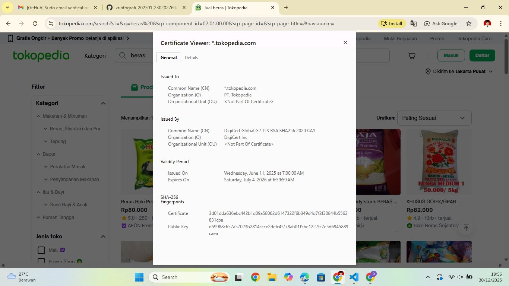

# Laporan Praktikum Kriptografi
Minggu ke-: 12  
Topik: Aplikasi TLS & E-commerce  
Nama: Julian Aji Pratama  
NIM: 230202760  
Kelas: 5IKRB  

---

## 1. Tujuan
1. Menganalisis penggunaan kriptografi pada **email** dan **SSL/TLS**.  
2. Menjelaskan enkripsi dalam transaksi **e-commerce**.  
3. Mengevaluasi isu **etika & privasi** dalam penggunaan kriptografi di kehidupan sehari-hari.  

---

## 2. Dasar Teori
Transport Layer Security (TLS) merupakan protokol keamanan yang digunakan untuk melindungi komunikasi data pada jaringan komputer, khususnya internet. TLS adalah pengembangan dari Secure Socket Layer (SSL) dan digunakan secara luas pada website dengan protokol HTTPS. TLS menyediakan tiga layanan utama yaitu kerahasiaan (confidentiality), integritas data (integrity), dan autentikasi (authentication).

Dalam TLS, sertifikat digital berperan penting sebagai alat autentikasi server. Sertifikat ini diterbitkan oleh Certificate Authority (CA) terpercaya dan berisi informasi identitas pemilik sertifikat, kunci publik, masa berlaku, serta algoritma kriptografi yang digunakan. Algoritma yang umum dipakai pada TLS adalah RSA atau ECDSA untuk pertukaran kunci dan AES untuk enkripsi data.

Pada sistem e-commerce, TLS digunakan untuk melindungi informasi sensitif seperti username, password, dan data pembayaran. Tanpa TLS, data yang dikirimkan melalui jaringan dapat disadap oleh pihak tidak berwenang menggunakan teknik seperti Man-in-the-Middle (MitM).

---

## 3. Alat dan Bahan
- Web browser (Google Chrome)  
- Koneksi internet  
- Git dan akun GitHub  
- Website e-commerce (Tokopedia)    

---

## 4. Langkah Percobaan
(Tuliskan langkah yang dilakukan sesuai instruksi.  
Contoh format:
1. Membuka website e-commerce menggunakan browser (contoh: Tokopedia dan Shopee).
2. Memastikan website menggunakan protokol HTTPS.
3. Mengklik ikon gembok pada address bar browser.
4. Melihat detail sertifikat digital yang digunakan website.
5. Mencatat informasi Certificate Authority (CA), masa berlaku, dan algoritma enkripsi.
6. Membandingkan website HTTPS dengan website HTTP (tanpa enkripsi).
7. Mendokumentasikan hasil observasi dalam bentuk screenshot.)

---

## 5. Source Code
Pada praktikum ini tidak dilakukan implementasi source code karena kegiatan berfokus pada observasi, analisis, dan studi kasus penerapan TLS/SSL pada email dan e-commerce.

---

## 6. Hasil dan Pembahasan
(- Lampirkan screenshot hasil eksekusi program (taruh di folder `screenshots/`).  
- Berikan tabel atau ringkasan hasil uji jika diperlukan.  
- Jelaskan apakah hasil sesuai ekspektasi.  
- Bahas error (jika ada) dan solusinya. 

Hasil eksekusi program Caesar Cipher:


)

---

## 7. Jawaban Pertanyaan  
- Pertanyaan 1: Apa perbedaan utama antara HTTP dan HTTPS?  
  HTTP tidak menggunakan enkripsi sehingga data dikirimkan dalam bentuk plaintext, sedangkan HTTPS menggunakan SSL/TLS untuk mengenkripsi data sehingga lebih aman dari penyadapan.
- Pertanyaan 2: Mengapa sertifikat digital menjadi penting dalam komunikasi TLS?  
  Karena sertifikat digital digunakan untuk memverifikasi identitas server dan mencegah serangan pemalsuan server (spoofing). Sertifikat juga menyediakan kunci publik yang digunakan dalam proses enkripsi.
- Pertanyaan 3: Bagaimana kriptografi mendukung privasi dalam komunikasi digital, tetapi sekaligus menimbulkan tantangan hukum dan etika?  
  Kriptografi melindungi privasi pengguna dengan mengenkripsi komunikasi, namun juga menimbulkan tantangan hukum dan etika seperti kesulitan penegakan hukum dan dilema pengawasan komunikasi oleh pemerintah atau perusahaan.

---

## 8. Kesimpulan
TLS dan sertifikat digital memiliki peran penting dalam menjaga keamanan komunikasi digital, khususnya pada email dan e-commerce. Penggunaan kriptografi meningkatkan privasi dan kepercayaan pengguna, namun perlu diimbangi dengan kebijakan etika dan hukum yang tepat.

---

## 9. Daftar Pustaka
(Cantumkan referensi yang digunakan.  
Contoh:  
- Katz, J., & Lindell, Y. *Introduction to Modern Cryptography*.  
- Stallings, W. *Cryptography and Network Security*.  )

---

## 10. Commit Log
(Tuliskan bukti commit Git yang relevan.  
Contoh:
```
commit abc12345
Author: Nama Mahasiswa <email>
Date:   2025-09-20

    week2-cryptosystem: implementasi Caesar Cipher dan laporan )
```
