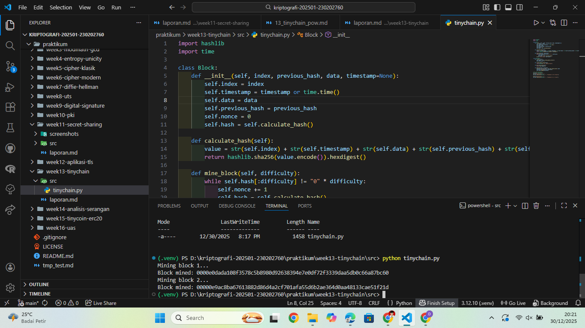

# Laporan Praktikum Kriptografi
Minggu ke-: 13  
Topik: TinyChain – Proof of Work (PoW)  
Nama: Julian Aji Pratama  
NIM: 230202760  
Kelas: 5IKRB  

---

## 1. Tujuan
1. Menjelaskan peran **hash function** dalam blockchain.  
2. Melakukan simulasi sederhana **Proof of Work (PoW)**.  
3. Menganalisis keamanan cryptocurrency berbasis kriptografi.

---

## 2. Dasar Teori
Blockchain merupakan struktur data terdistribusi yang terdiri dari rangkaian blok yang saling terhubung menggunakan hash kriptografis. Setiap blok menyimpan data transaksi, hash blok sebelumnya, timestamp, dan nilai nonce. Fungsi hash kriptografis seperti SHA-256 digunakan untuk menjamin integritas data dan sifat immutability pada blockchain.

Proof of Work (PoW) adalah mekanisme konsensus yang digunakan untuk memvalidasi blok baru dalam blockchain. Dalam PoW, penambang harus menemukan nilai nonce yang menghasilkan hash dengan pola tertentu (misalnya diawali sejumlah nol). Proses ini membutuhkan komputasi yang besar sehingga menyulitkan pihak jahat untuk memanipulasi data blockchain.

Dalam cryptocurrency seperti Bitcoin, PoW berfungsi untuk mencegah serangan double spending dan menjaga keamanan jaringan. Namun, mekanisme ini memiliki kelemahan utama yaitu konsumsi energi yang tinggi.

---

## 3. Alat dan Bahan
- Python 3.12.10  
- Visual Studio Code / editor lain  
- Git dan akun GitHub  
- Library tambahan (misalnya pycryptodome, jika diperlukan)  

---

## 4. Langkah Percobaan
(Tuliskan langkah yang dilakukan sesuai instruksi.  
Contoh format:
1. Membuat file `tinychain.py` di folder `praktikum/week13-tinychain/src/`.
2. Menyalin kode program dari panduan praktikum.
3. Menjalankan program dengan perintah `python tinychain.py`.)

---

## 5. Source Code
(Salin kode program utama yang dibuat atau dimodifikasi.  
Gunakan blok kode:

```python
import hashlib
import time

class Block:
    def __init__(self, index, previous_hash, data, timestamp=None):
        self.index = index
        self.timestamp = timestamp or time.time()
        self.data = data
        self.previous_hash = previous_hash
        self.nonce = 0
        self.hash = self.calculate_hash()

    def calculate_hash(self):
        value = str(self.index) + str(self.timestamp) + str(self.data) + str(self.previous_hash) + str(self.nonce)
        return hashlib.sha256(value.encode()).hexdigest()

    def mine_block(self, difficulty):
        while self.hash[:difficulty] != "0" * difficulty:
            self.nonce += 1
            self.hash = self.calculate_hash()
        print(f"Block mined: {self.hash}")

class Blockchain:
    def __init__(self):
        self.chain = [self.create_genesis_block()]
        self.difficulty = 4

    def create_genesis_block(self):
        return Block(0, "0", "Genesis Block")

    def get_latest_block(self):
        return self.chain[-1]

    def add_block(self, new_block):
        new_block.previous_hash = self.get_latest_block().hash
        new_block.mine_block(self.difficulty)
        self.chain.append(new_block)

# Uji coba blockchain
my_chain = Blockchain()
print("Mining block 1...")
my_chain.add_block(Block(1, "", "Transaksi A → B: 10 Coin"))

print("Mining block 2...")
my_chain.add_block(Block(2, "", "Transaksi B → C: 5 Coin"))
```
)

---

## 6. Hasil dan Pembahasan
(- Lampirkan screenshot hasil eksekusi program (taruh di folder `screenshots/`).  
- Berikan tabel atau ringkasan hasil uji jika diperlukan.  
- Jelaskan apakah hasil sesuai ekspektasi.  
- Bahas error (jika ada) dan solusinya. 

Hasil eksekusi program Caesar Cipher:


)

---

## 7. Jawaban Pertanyaan  
- Pertanyaan 1: Mengapa fungsi hash sangat penting dalam blockchain?  
  Karena fungsi hash menjamin integritas data dan menghubungkan setiap blok dengan blok sebelumnya. Perubahan kecil pada data akan menghasilkan hash yang sangat berbeda sehingga manipulasi data dapat langsung terdeteksi.
- Pertanyaan 2: Bagaimana Proof of Work mencegah double spending?  
  Proof of Work mengharuskan penambang melakukan komputasi yang mahal untuk menambahkan blok baru. Hal ini membuat penyerang sulit mengubah transaksi yang telah tercatat karena harus menambang ulang seluruh blok berikutnya.
- Pertanyaan 3: Apa kelemahan dari PoW dalam hal efisiensi energi?  
  PoW membutuhkan daya komputasi dan energi listrik yang sangat besar, sehingga kurang efisien dan berdampak negatif terhadap lingkungan.

---

## 8. Kesimpulan
Proof of Work dan fungsi hash merupakan komponen penting dalam keamanan blockchain. Mekanisme ini mampu menjaga integritas dan keandalan data, namun memiliki kelemahan utama berupa konsumsi energi yang tinggi.

---

## 9. Daftar Pustaka
(Cantumkan referensi yang digunakan.  
Contoh:  
- Katz, J., & Lindell, Y. *Introduction to Modern Cryptography*.  
- Stallings, W. *Cryptography and Network Security*.  )

---

## 10. Commit Log
(Tuliskan bukti commit Git yang relevan.  
Contoh:
```
commit abc12345
Author: Nama Mahasiswa <email>
Date:   2025-09-20

    week2-cryptosystem: implementasi Caesar Cipher dan laporan )
```
