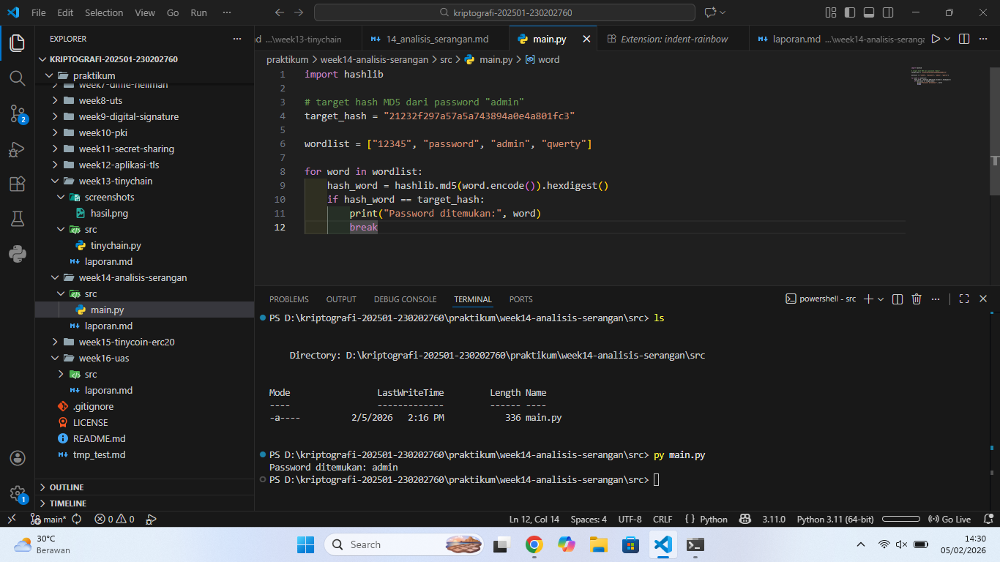

# Laporan Praktikum Kriptografi
Minggu ke-: 14  
Topik: Analisis Serangan Kriptografi  
Nama: Julian Aji Pratama  
NIM: 230202760  
Kelas: 5IKRB  

---

## 1. Tujuan
1. Mengidentifikasi jenis serangan pada sistem informasi nyata.  
2. Mengevaluasi kelemahan algoritma kriptografi yang digunakan.  
3. Memberikan rekomendasi algoritma kriptografi yang sesuai untuk perbaikan keamanan.

---

## 2. Dasar Teori
Kriptografi merupakan ilmu yang mempelajari teknik pengamanan data melalui proses enkripsi dan dekripsi. Salah satu komponen penting dalam kriptografi modern adalah hash function, yaitu fungsi yang mengubah data menjadi nilai tetap (digest) yang unik. Hash digunakan untuk penyimpanan password, verifikasi integritas data, dan tanda tangan digital.

MD5 (Message Digest 5) adalah algoritma hash yang menghasilkan output 128-bit. Dahulu MD5 populer karena cepat, namun kini dianggap tidak aman karena rentan terhadap collision attack dan brute force. Banyak sistem lama masih menggunakan MD5 untuk penyimpanan password, sehingga berisiko tinggi.

Serangan brute force dan dictionary attack adalah metode umum untuk memecahkan hash password. Brute force mencoba semua kemungkinan kombinasi, sedangkan dictionary attack menggunakan daftar kata sandi umum. Jika hash lemah seperti MD5 digunakan tanpa salt, password dapat dipecahkan dengan cepat.

---

## 3. Alat dan Bahan
- Python 3.11.0  
- Visual Studio Code / editor lain  
- Git dan akun GitHub  
- Library tambahan (misalnya pycryptodome, jika diperlukan)  

---

## 4. Langkah Percobaan
(Tuliskan langkah yang dilakukan sesuai instruksi.  
Contoh format:
1. Membuat file `main.py` di folder `praktikum/week14-analisis-serangan/src/`.
2. Menyalin kode program dari panduan praktikum.
3. Menjalankan program dengan perintah `python main.py`.)

---

## 5. Source Code
(Salin kode program utama yang dibuat atau dimodifikasi.  
Gunakan blok kode:

```python
import hashlib

# target hash MD5 dari password "admin"
target_hash = "21232f297a57a5a743894a0e4a801fc3"

wordlist = ["12345", "password", "admin", "qwerty"]

for word in wordlist:
    hash_word = hashlib.md5(word.encode()).hexdigest()
    if hash_word == target_hash:
        print("Password ditemukan:", word)
        break
```
)

---

## 6. Hasil dan Pembahasan
- Lampirkan screenshot hasil eksekusi program (taruh di folder `screenshots/`).  
- Berikan tabel atau ringkasan hasil uji jika diperlukan.  
- Jelaskan apakah hasil sesuai ekspektasi.  
- Bahas error (jika ada) dan solusinya. 

Program berhasil menemukan password "admin" dari hash MD5 menggunakan dictionary sederhana. Hal ini menunjukkan bahwa MD5 sangat rentan jika digunakan untuk menyimpan password tanpa salt.
Serangan berhasil karena:
* MD5 cepat dihitung sehingga mudah diuji berulang.
* Tidak ada salt.
* Password umum digunakan.

Hasil eksekusi program:



---

## 7. Jawaban Pertanyaan  
- Pertanyaan 1: Mengapa banyak sistem lama masih rentan terhadap brute force atau dictionary attack?  
  Karena sistem lama masih menggunakan algoritma hash lemah seperti MD5/SHA1, tidak memakai salt, dan kebijakan password lemah.
- Pertanyaan 2: Apa bedanya kelemahan algoritma dengan kelemahan implementasi?  
  Kelemahan algoritma berasal dari desain kriptografi itu sendiri. Kelemahan implementasi berasal dari cara penggunaan, misalnya tidak memakai salt atau konfigurasi salah.
- Pertanyaan 3: Bagaimana organisasi dapat memastikan sistem kriptografi mereka tetap aman di masa depan?  
  Dengan memperbarui algoritma, audit keamanan rutin, menerapkan standar keamanan terbaru, dan pelatihan keamanan.

---

## 8. Kesimpulan
MD5 tidak lagi aman untuk penyimpanan password karena rentan terhadap brute force dan collision. Sistem modern harus menggunakan algoritma yang lebih kuat dan mekanisme tambahan seperti salt.

---

## 9. Daftar Pustaka
- Stallings, W. Cryptography and Network Security, 2017.
- Katz, J., & Lindell, Y. Introduction to Modern Cryptography.
- OWASP Password Storage Cheat Sheet.

---

## 10. Commit Log
```
commit e58cc87ff4e900f3ecd5862a4c876d8697916881 (HEAD -> main, origin/main, origin/HEAD)
Author: julian-ajipratama <julianap28072005@gmail.com>
Date:   Thu Feb 5 14:36:40 2026 +0700

    week14-analisis-serangan
```
