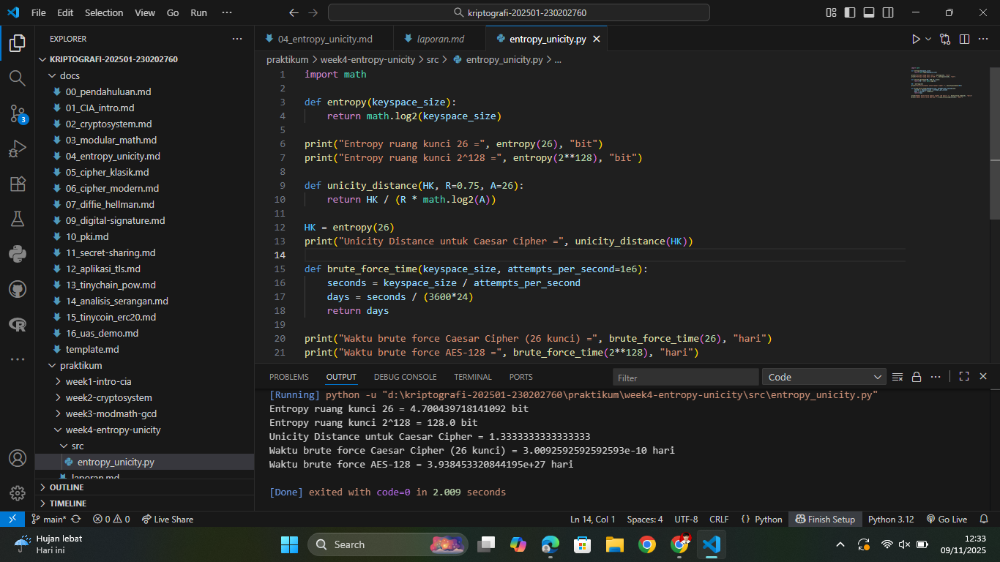

# Laporan Praktikum Kriptografi
Minggu ke-: 4  
Topik: Entropy & Unicity Distance (Evaluasi Kekuatan Kunci dan Brute Force)  
Nama: Julian Aji Pratama  
NIM: 230202760  
Kelas: 5IKRB  

---

## 1. Tujuan
1. Menyelesaikan perhitungan sederhana terkait entropi kunci.  
2. Menggunakan teorema Euler pada contoh perhitungan modular & invers.  
3. Menghitung **unicity distance** untuk ciphertext tertentu.  
4. Menganalisis kekuatan kunci berdasarkan entropi dan unicity distance.  
5. Mengevaluasi potensi serangan brute force pada kriptosistem sederhana.

---

## 2. Dasar Teori
Entropi kunci (H(K)) adalah ukuran ketidakpastian atau jumlah informasi yang terkandung dalam pilihan kunci pada suatu sistem kriptografi. Secara matematika, untuk ruang kunci dengan ukuran |K|, entropi dinyatakan sebagai H(K)=log₂|K| (satuan: bit). Semakin besar entropi, semakin besar jumlah bit yang harus ditebak penyerang saat melakukan brute-force.

Unicity distance (U) merupakan ukuran panjang ciphertext minimum yang diperlukan agar hanya ada satu kunci yang menghasilkan plaintext "masuk akal" (yaitu menghilangkan ambiguitas berdasarkan redundansi bahasa). Rumus yang digunakan:
U = H(K) / (R · log₂|A|)

dengan R adalah redundansi bahasa (contoh: untuk bahasa Inggris sering dipakai R ≈ 0.75) dan |A| ukuran alfabet (contoh 26 untuk A–Z). Jika ciphertext lebih panjang dari U, kemungkinan besar akan ada cukup informasi statistik untuk menentukan kunci tunggal.

Brute force attack menguji semua kemungkinan kunci sampai menemukan kunci yang benar. Waktu yang diperlukan bergantung pada ukuran ruang kunci dan kecepatan percobaan (attempts per second). Meskipun algoritma modern kuat secara teoritis, perkembangan perangkat keras dan teknik optimasi dapat membuat brute force praktis pada kunci kecil.


---

## 3. Alat dan Bahan
(- Python 3.12.2  
- Visual Studio Code / editor lain  
- Git dan akun GitHub  
- Library tambahan (math)  )

---

## 4. Langkah Percobaan
(Tuliskan langkah yang dilakukan sesuai instruksi.  
Contoh format:
1. Membuat file `entropy_unicity.py` di folder `praktikum/week4-entropy-unicity/src/`.
2. Menyalin kode program dari panduan praktikum.
3. Menjalankan program dengan perintah `python entropy_unicity.py`.)

---

## 5. Source Code
Salin kode program utama yang dibuat atau dimodifikasi.  
Gunakan blok kode:

```python
import math

def entropy(keyspace_size):
    return math.log2(keyspace_size)

print("Entropy ruang kunci 26 =", entropy(26), "bit")
print("Entropy ruang kunci 2^128 =", entropy(2**128), "bit")

def unicity_distance(HK, R=0.75, A=26):
    return HK / (R * math.log2(A))

HK = entropy(26)
print("Unicity Distance untuk Caesar Cipher =", unicity_distance(HK))

def brute_force_time(keyspace_size, attempts_per_second=1e6):
    seconds = keyspace_size / attempts_per_second
    days = seconds / (3600*24)
    return days

print("Waktu brute force Caesar Cipher (26 kunci) =", brute_force_time(26), "hari")
print("Waktu brute force AES-128 =", brute_force_time(2**128), "hari")
```

---

## 6. Hasil dan Pembahasan
(- Lampirkan screenshot hasil eksekusi program (taruh di folder `screenshots/`).  
- Berikan tabel atau ringkasan hasil uji jika diperlukan.  
- Jelaskan apakah hasil sesuai ekspektasi.  
- Bahas error (jika ada) dan solusinya. 

Hasil eksekusi program Caesar Cipher:


)

---

## 7. Jawaban Pertanyaan  
- Pertanyaan 1: Apa arti dari nilai **entropy** dalam konteks kekuatan kunci?
  Entropy mengukur jumlah bit informasi yang terkandung dalam pemilihan kunci; semakin besar entropy, semakin banyak keraguan (uncertainty) terhadap nilai kunci sehingga semakin sulit bagi penyerang untuk menebak kunci melalui brute force. Contoh: entropi 4.7 bit (Caesar) berarti hanya ~26 kemungkinan — sangat kecil; entropi 128 bit berarti 2^{128} kemungkinan — sangat besar.
- Pertanyaan 2: Mengapa unicity distance penting dalam menentukan keamanan suatu cipher?
  Unicity distance memberikan estimasi panjang ciphertext yang diperlukan agar analisis statistik bahasa cukup untuk menentukan kunci tunggal. Jika ciphertext lebih panjang dari U, maka ciphertext berpotensi memberi cukup informasi untuk menemukan satu kunci yang menghasilkan plaintext yang "masuk akal". Jadi U membantu memahami kapan kelemahan bahasa dan redundansi dapat dieksploitasi.
- Pertanyaan 3: Mengapa brute force masih menjadi ancaman meskipun algoritma sudah kuat?
  Brute force mengancam bila kunci tidak cukup panjang atau bila implementasi/operasional lemah (kunci yang dipilih buruk, kunci disimpan/bocor, pengulangan kunci). Selain itu, kemajuan perangkat keras, optimasi algoritmik, atau arsitektur terdistribusi (GPU/ASIC/cloud) dapat mengecilkan waktu brute-force. Oleh karena itu, panjang kunci dan manajemen kunci tetap krusial.
  
---

## 8. Kesimpulan
Berdasarkan hasil percobaan, dapat disimpulkan bahwa entropi berperan penting dalam menentukan kekuatan sebuah ruang kunci. Semakin besar nilai entropi, semakin sulit bagi penyerang untuk menebak kunci melalui brute force. Nilai unicity distance yang kecil, seperti pada Caesar Cipher (sekitar 1,33 karakter), menunjukkan bahwa ciphertext pendek sudah cukup untuk dianalisis secara statistik sehingga cipher tersebut sangat lemah. Sebaliknya, algoritma modern seperti AES-128 dan AES-256 memiliki entropi yang sangat besar, membuat serangan brute force menjadi tidak praktis dengan teknologi saat ini. Oleh karena itu, keamanan kriptosistem tidak hanya bergantung pada algoritma, tetapi juga pada panjang dan manajemen kunci yang baik.

---

## 9. Daftar Pustaka
-

---

## 10. Commit Log
(Tuliskan bukti commit Git yang relevan.  
Contoh:
```
commit abc12345
Author: Nama Mahasiswa <email>
Date:   2025-09-20

    week2-cryptosystem: implementasi Caesar Cipher dan laporan )
```
