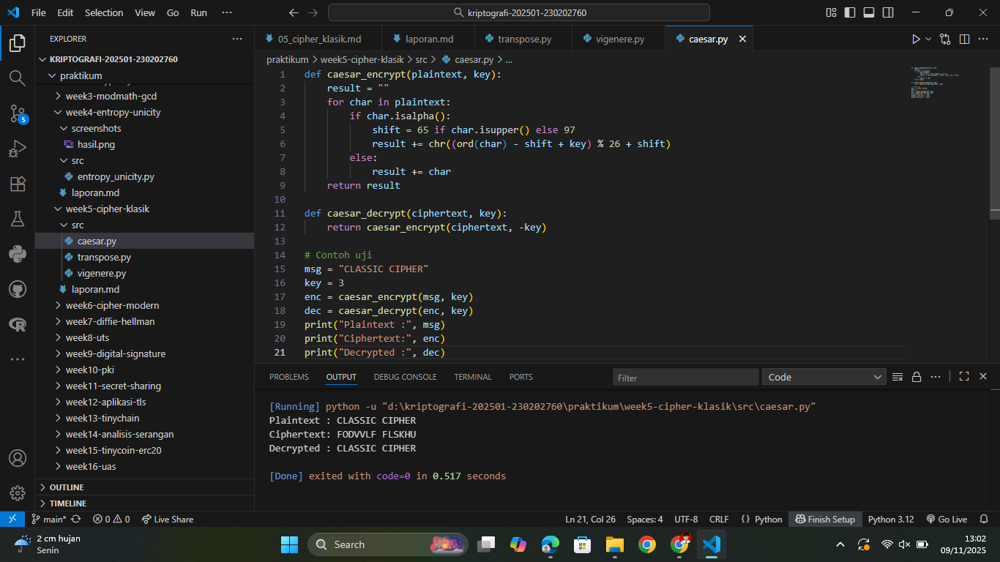
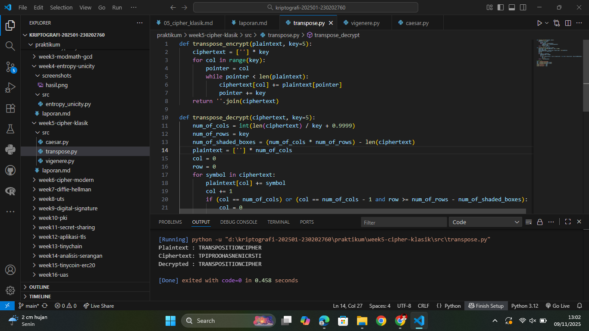
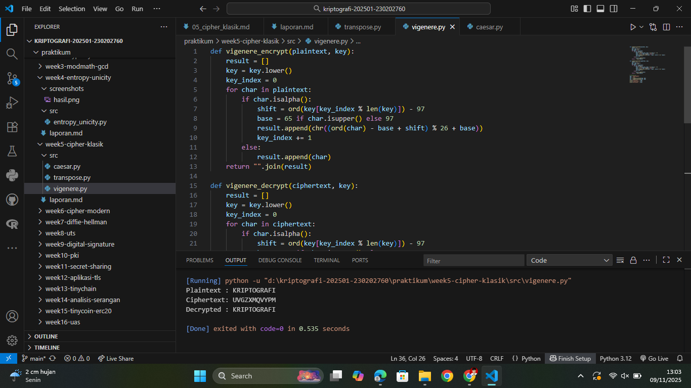

# Laporan Praktikum Kriptografi
Minggu ke-: 5  
Topik: Cipher Klasik (Caesar, Vigenère, Transposisi)  
Nama: Julian Aji Pratama  
NIM: 230202760  
Kelas: 5IKRB  

---

## 1. Tujuan
1. Menerapkan algoritma **Caesar Cipher** untuk enkripsi dan dekripsi teks.  
2. Menerapkan algoritma **Vigenère Cipher** dengan variasi kunci.  
3. Mengimplementasikan algoritma transposisi sederhana.  
4. Menjelaskan kelemahan algoritma kriptografi klasik.

---

## 2. Dasar Teori
Cipher klasik merupakan bentuk awal dari algoritma kriptografi yang digunakan sebelum munculnya cipher modern berbasis blok dan stream. Cipher klasik umumnya bekerja pada tingkat karakter atau huruf, dengan dua kategori utama: cipher substitusi dan cipher transposisi.

Caesar Cipher adalah bentuk paling sederhana dari cipher substitusi, di mana setiap huruf plaintext digeser sejumlah tetap posisi pada alfabet. Misalnya, dengan pergeseran 3, huruf A menjadi D, B menjadi E, dan seterusnya. Cipher ini mudah diimplementasikan tetapi sangat lemah karena hanya memiliki 25 kemungkinan kunci.

Vigenère Cipher merupakan pengembangan dari Caesar Cipher dengan menggunakan kata kunci untuk menentukan pergeseran setiap huruf. Setiap karakter kunci menentukan nilai geser yang berbeda, sehingga pola pergeseran lebih kompleks dan lebih sulit untuk dianalisis dengan frekuensi tunggal. Namun, cipher ini tetap rentan terhadap serangan jika panjang kunci diketahui atau teks cukup panjang.

Cipher transposisi tidak mengganti huruf, tetapi mengubah posisi huruf dalam pesan. Misalnya, teks ditulis ke dalam tabel dengan jumlah kolom tertentu dan dibaca kolom demi kolom untuk menghasilkan ciphertext. Meskipun menjaga frekuensi huruf tetap sama, cipher transposisi dapat dipecahkan dengan menganalisis pola urutan huruf.


---

## 3. Alat dan Bahan
(- Python 3.12.2  
- Visual Studio Code / editor lain  
- Git dan akun GitHub  
- Library tambahan (misalnya pycryptodome, jika diperlukan)  )

---

## 4. Langkah Percobaan
(Tuliskan langkah yang dilakukan sesuai instruksi.  
Contoh format:
1. Membuat file `caesar.py, vigenere.py, dan transpose.py` di folder `praktikum/week5-cipher-klasik/src/`.
2. Menyalin kode program dari panduan praktikum.
3. Menjalankan program dengan perintah `python caesar.py, vigenere.py, dan transpose.py`.)

---

## 5. Source Code
(Salin kode program utama yang dibuat atau dimodifikasi.  
Gunakan blok kode:

caesar.py
```python
def caesar_encrypt(plaintext, key):
    result = ""
    for char in plaintext:
        if char.isalpha():
            shift = 65 if char.isupper() else 97
            result += chr((ord(char) - shift + key) % 26 + shift)
        else:
            result += char
    return result

def caesar_decrypt(ciphertext, key):
    return caesar_encrypt(ciphertext, -key)

# Contoh uji
msg = "CLASSIC CIPHER"
key = 3
enc = caesar_encrypt(msg, key)
dec = caesar_decrypt(enc, key)
print("Plaintext :", msg)
print("Ciphertext:", enc)
print("Decrypted :", dec)
```

vigenere.py
```python
def vigenere_encrypt(plaintext, key):
    result = []
    key = key.lower()
    key_index = 0
    for char in plaintext:
        if char.isalpha():
            shift = ord(key[key_index % len(key)]) - 97
            base = 65 if char.isupper() else 97
            result.append(chr((ord(char) - base + shift) % 26 + base))
            key_index += 1
        else:
            result.append(char)
    return "".join(result)

def vigenere_decrypt(ciphertext, key):
    result = []
    key = key.lower()
    key_index = 0
    for char in ciphertext:
        if char.isalpha():
            shift = ord(key[key_index % len(key)]) - 97
            base = 65 if char.isupper() else 97
            result.append(chr((ord(char) - base - shift) % 26 + base))
            key_index += 1
        else:
            result.append(char)
    return "".join(result)

# Contoh uji
msg = "KRIPTOGRAFI"
key = "KEY"
enc = vigenere_encrypt(msg, key)
dec = vigenere_decrypt(enc, key)
print("Plaintext :", msg)
print("Ciphertext:", enc)
print("Decrypted :", dec)
```

transpose.py
```python
def transpose_encrypt(plaintext, key=5):
    ciphertext = [''] * key
    for col in range(key):
        pointer = col
        while pointer < len(plaintext):
            ciphertext[col] += plaintext[pointer]
            pointer += key
    return ''.join(ciphertext)

def transpose_decrypt(ciphertext, key=5):
    num_of_cols = int(len(ciphertext) / key + 0.9999)
    num_of_rows = key
    num_of_shaded_boxes = (num_of_cols * num_of_rows) - len(ciphertext)
    plaintext = [''] * num_of_cols
    col = 0
    row = 0
    for symbol in ciphertext:
        plaintext[col] += symbol
        col += 1
        if (col == num_of_cols) or (col == num_of_cols - 1 and row >= num_of_rows - num_of_shaded_boxes):
            col = 0
            row += 1
    return ''.join(plaintext)

# Contoh uji
msg = "TRANSPOSITIONCIPHER"
enc = transpose_encrypt(msg, key=5)
dec = transpose_decrypt(enc, key=5)
print("Plaintext :", msg)
print("Ciphertext:", enc)
print("Decrypted :", dec)
```
)

---

## 6. Hasil dan Pembahasan
(- Lampirkan screenshot hasil eksekusi program (taruh di folder `screenshots/`).  
- Berikan tabel atau ringkasan hasil uji jika diperlukan.  
- Jelaskan apakah hasil sesuai ekspektasi.  
- Bahas error (jika ada) dan solusinya. 

Hasil eksekusi program Caesar Cipher:




)

---

## 7. Jawaban Pertanyaan 
- Pertanyaan 1: Apa kelemahan utama algoritma Caesar Cipher dan Vigenère Cipher?
  Caesar Cipher memiliki kelemahan utama berupa ruang kunci kecil sehingga mudah dipecahkan dengan brute-force. Vigenère Cipher lebih kuat, tetapi jika panjang kunci diketahui atau plaintext cukup panjang, pola pergeseran bisa dianalisis untuk menemukan kunci.
- Pertanyaan 2: Mengapa cipher klasik mudah diserang dengan analisis frekuensi?
  Cipher klasik bekerja pada tingkat huruf tanpa mengubah distribusi frekuensi huruf dalam bahasa. Karena setiap bahasa memiliki pola frekuensi khas, penyerang dapat membandingkan frekuensi huruf ciphertext dengan frekuensi umum bahasa untuk menebak substitusi atau posisi huruf.
- Pertanyaan 3: Bandingkan kelebihan dan kelemahan cipher substitusi vs transposisi.
  Cipher substitusi mengubah nilai huruf (A→D, B→E, dst), sementara transposisi hanya menukar posisi huruf. Substitusi mudah dikenali karena pola frekuensi tetap, sedangkan transposisi lebih sulit dianalisis frekuensinya tetapi dapat dianalisis pola posisional. Dalam praktik modern, keduanya sering dikombinasikan untuk meningkatkan keamanan (seperti pada algoritma blok modern). 

---

## 8. Kesimpulan
Berdasarkan hasil percobaan, Caesar Cipher, Vigenère Cipher, dan Transposisi Cipher berhasil diimplementasikan dengan benar menggunakan Python. Setiap algoritma menunjukkan prinsip dasar kriptografi klasik, yaitu substitusi dan transposisi. Namun, karena ruang kunci yang kecil dan pola yang mudah ditebak, cipher klasik tidak lagi aman untuk komunikasi modern. Meski begitu, algoritma ini tetap penting untuk memahami dasar teori dan evolusi kriptografi menuju sistem modern yang lebih kuat.

---

## 9. Daftar Pustaka
-

---

## 10. Commit Log
```
commit 33db7f4307b5693c079ae85ee26e3f4772ac35bf (HEAD -> main, origin/main, origin/HEAD)
Author: julian-ajipratama <julianap28072005@gmail.com>
Date:   Sun Nov 9 13:07:35 2025 +0700

    week5-cipher-klasik
```
