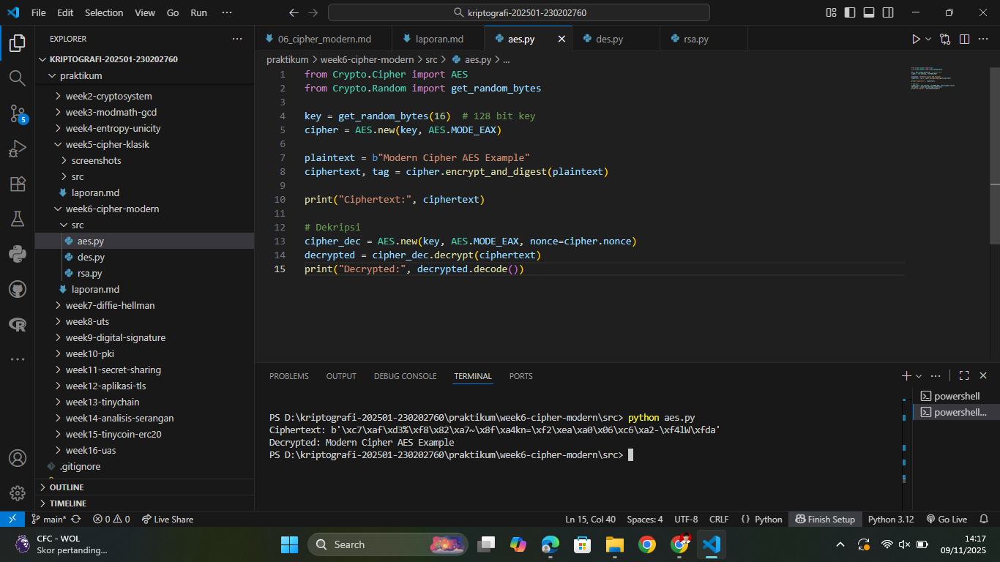
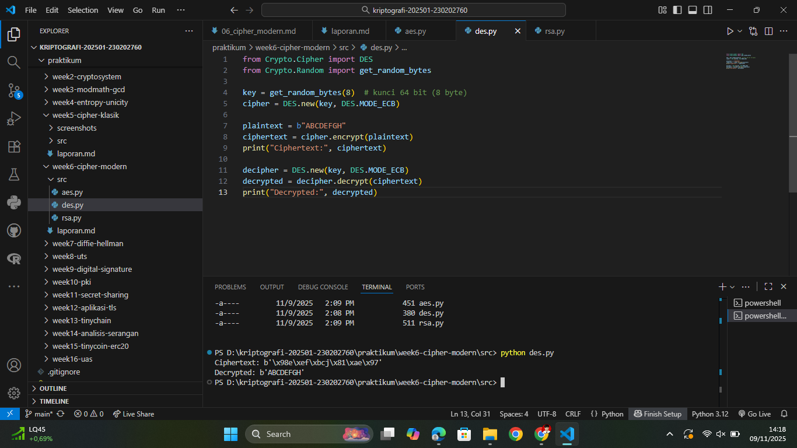
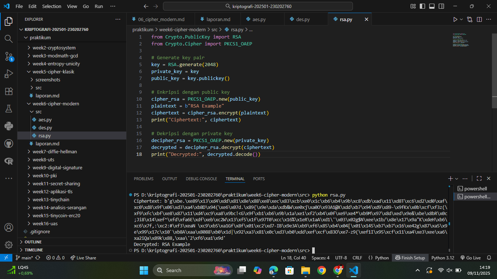

# Laporan Praktikum Kriptografi
Minggu ke-: 6  
Topik: Cipher Modern (DES, AES, RSA)  
Nama: Julian Aji Pratama  
NIM: 230202760  
Kelas: 5IKRB  

---

## 1. Tujuan
1. Mengimplementasikan algoritma **DES** untuk blok data sederhana.  
2. Menerapkan algoritma **AES** dengan panjang kunci 128 bit.  
3. Menjelaskan proses pembangkitan kunci publik dan privat pada algoritma **RSA**. 

---

## 2. Dasar Teori
Cipher modern dikembangkan untuk mengatasi kelemahan cipher klasik dengan memperkenalkan sistem kunci yang lebih kuat, struktur matematis yang kompleks, dan ukuran blok data yang besar.

DES (Data Encryption Standard) merupakan algoritma block cipher yang menggunakan kunci sepanjang 56 bit dan blok data 64 bit. Meskipun populer di masa lalu, DES kini dianggap tidak aman karena ukuran kuncinya terlalu kecil sehingga rentan terhadap brute force attack.

AES (Advanced Encryption Standard) menggantikan DES sebagai standar enkripsi modern. AES bekerja dengan blok data 128 bit dan mendukung ukuran kunci 128, 192, atau 256 bit. Keunggulannya terletak pada efisiensi dan tingkat keamanan yang tinggi, membuatnya banyak digunakan pada berbagai sistem keamanan data modern.

RSA (Rivest–Shamir–Adleman) adalah algoritma kriptografi asimetris yang menggunakan sepasang kunci publik dan privat. Keamanan RSA didasarkan pada kesulitan faktorisasi bilangan prima besar. Prosesnya melibatkan pembangkitan kunci, enkripsi dengan kunci publik, dan dekripsi dengan kunci privat.

---

## 3. Alat dan Bahan
(- Python 3.12.2  
- Visual Studio Code / editor lain  
- Git dan akun GitHub  
- Library tambahan (pycryptodome)  )

---

## 4. Langkah Percobaan
(Tuliskan langkah yang dilakukan sesuai instruksi.  
Contoh format:
1. Membuat file `aes.py, rsa.py, dan des.py` di folder `praktikum/week6-cipher-modern/src/`.
2. Menyalin kode program dari panduan praktikum.
3. Menjalankan program dengan perintah `python aes.py, rsa.py, dan des.py`.)

---

## 5. Source Code
(Salin kode program utama yang dibuat atau dimodifikasi.  
Gunakan blok kode:

aes.py
```python
from Crypto.Cipher import AES
from Crypto.Random import get_random_bytes

key = get_random_bytes(16)  # 128 bit key
cipher = AES.new(key, AES.MODE_EAX)

plaintext = b"Modern Cipher AES Example"
ciphertext, tag = cipher.encrypt_and_digest(plaintext)

print("Ciphertext:", ciphertext)

# Dekripsi
cipher_dec = AES.new(key, AES.MODE_EAX, nonce=cipher.nonce)
decrypted = cipher_dec.decrypt(ciphertext)
print("Decrypted:", decrypted.decode())
```

des.py
```python
from Crypto.Cipher import DES
from Crypto.Random import get_random_bytes

key = get_random_bytes(8)  # kunci 64 bit (8 byte)
cipher = DES.new(key, DES.MODE_ECB)

plaintext = b"ABCDEFGH"
ciphertext = cipher.encrypt(plaintext)
print("Ciphertext:", ciphertext)

decipher = DES.new(key, DES.MODE_ECB)
decrypted = decipher.decrypt(ciphertext)
print("Decrypted:", decrypted)
```

rsa.py
```python
from Crypto.PublicKey import RSA
from Crypto.Cipher import PKCS1_OAEP

# Generate key pair
key = RSA.generate(2048)
private_key = key
public_key = key.publickey()

# Enkripsi dengan public key
cipher_rsa = PKCS1_OAEP.new(public_key)
plaintext = b"RSA Example"
ciphertext = cipher_rsa.encrypt(plaintext)
print("Ciphertext:", ciphertext)

# Dekripsi dengan private key
decipher_rsa = PKCS1_OAEP.new(private_key)
decrypted = decipher_rsa.decrypt(ciphertext)
print("Decrypted:", decrypted.decode())
```
)

---

## 6. Hasil dan Pembahasan
(- Lampirkan screenshot hasil eksekusi program (taruh di folder `screenshots/`).  
- Berikan tabel atau ringkasan hasil uji jika diperlukan.  
- Jelaskan apakah hasil sesuai ekspektasi.  
- Bahas error (jika ada) dan solusinya. 

Hasil eksekusi program Caesar Cipher:




)

---

## 7. Jawaban Pertanyaan
(Jawab pertanyaan diskusi yang diberikan pada modul.  
- Pertanyaan 1: Apa perbedaan mendasar antara DES, AES, dan RSA dalam hal kunci dan keamanan?
  Perbedaan utama antara DES, AES, dan RSA terletak pada jenis algoritmanya. DES dan AES termasuk cipher simetris, artinya kunci enkripsi dan dekripsi sama. RSA adalah cipher asimetris, menggunakan pasangan kunci publik dan privat. Dari sisi keamanan, AES jauh lebih kuat karena ukuran kunci yang besar dan desain bloknya yang kompleks.
- Pertanyaan 2: Mengapa AES lebih banyak digunakan dibanding DES di era modern?
  AES lebih banyak digunakan karena lebih cepat, aman, dan sudah distandardisasi secara global. DES dianggap tidak lagi aman karena ukuran kuncinya hanya 56 bit, yang mudah dipecahkan oleh brute force.
- Pertanyaan 3: Mengapa RSA dikategorikan sebagai algoritma asimetris, dan bagaimana proses pembangkitan kuncinya?
  RSA dikategorikan sebagai algoritma asimetris karena menggunakan dua kunci berbeda. Kunci publik digunakan untuk enkripsi dan disebarluaskan, sedangkan kunci privat digunakan untuk dekripsi dan dijaga kerahasiaannya. Proses pembangkitan kuncinya melibatkan pemilihan dua bilangan prima besar dan perhitungan modulus serta eksponen publik dan privat.
)

---

## 8. Kesimpulan
Dari hasil praktikum ini dapat disimpulkan bahwa cipher modern memiliki tingkat keamanan yang jauh lebih tinggi dibanding cipher klasik. AES menjadi standar utama karena efisiensinya dalam enkripsi blok data besar dan ketahanannya terhadap brute force. RSA memberikan keamanan tambahan melalui konsep kunci publik dan privat, memungkinkan komunikasi aman tanpa perlu bertukar kunci secara langsung. Dengan demikian, kombinasi algoritma simetris (AES) dan asimetris (RSA) menjadi fondasi utama keamanan kriptografi modern.

---

## 9. Daftar Pustaka
-

---

## 10. Commit Log
(Tuliskan bukti commit Git yang relevan.  
Contoh:
```
commit abc12345
Author: Nama Mahasiswa <email>
Date:   2025-09-20

    week2-cryptosystem: implementasi Caesar Cipher dan laporan )
```
