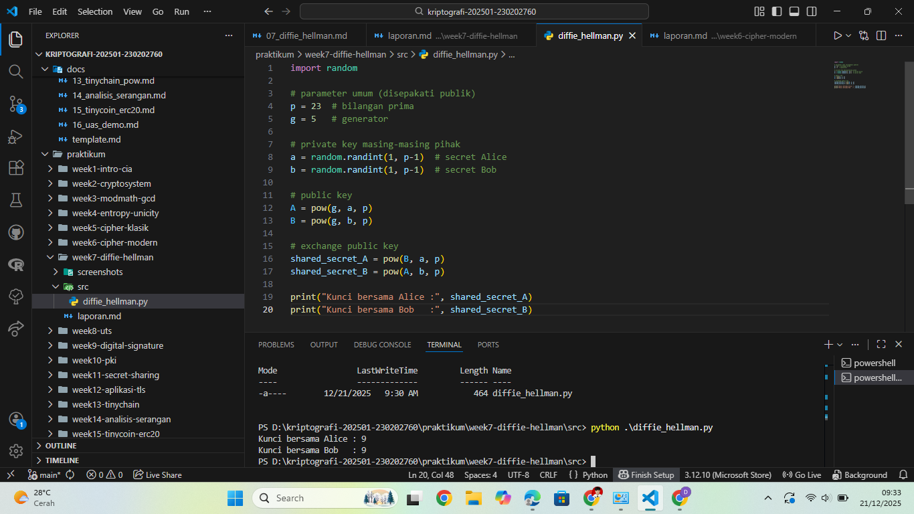

# Laporan Praktikum Kriptografi
Minggu ke-: 7  
Topik: Diffie-Hellman Key Exchange  
Nama: Julian Aji Pratama  
NIM: 230202760  
Kelas: 5IKRB  

---

## 1. Tujuan
1. Melakukan simulasi protokol **Diffie-Hellman** untuk pertukaran kunci publik.  
2. Menjelaskan mekanisme pertukaran kunci rahasia menggunakan bilangan prima dan logaritma diskrit.  
3. Menganalisis potensi serangan pada protokol Diffie-Hellman (termasuk serangan **Man-in-the-Middle / MITM**).  

---

## 2. Dasar Teori
Diffie-Hellman Key Exchange merupakan protokol kriptografi yang memungkinkan dua pihak untuk membangun kunci rahasia bersama melalui saluran komunikasi yang tidak aman. Protokol ini diperkenalkan oleh Whitfield Diffie dan Martin Hellman pada tahun 1976 dan menjadi dasar bagi banyak sistem keamanan modern.

Prinsip kerja Diffie-Hellman bergantung pada kesulitan logaritma diskrit dalam aritmetika modular. Meskipun nilai bilangan prima (p), generator (g), dan kunci publik diketahui oleh pihak lain, kunci privat tetap sulit dihitung secara komputasional. Namun, Diffie-Hellman murni tidak menyediakan mekanisme autentikasi sehingga rentan terhadap serangan MITM.

---

## 3. Alat dan Bahan
(- Python 3.12.10  
- Visual Studio Code / editor lain  
- Git dan akun GitHub  
- Library tambahan (misalnya pycryptodome, jika diperlukan)  )

---

## 4. Langkah Percobaan
(Tuliskan langkah yang dilakukan sesuai instruksi.  
Contoh format:
1. Membuat file `diffie_hellman.py` di folder `praktikum/week7-diffie-hellman/src/`.
2. Menyalin kode program dari panduan praktikum.
3. Menjalankan program dengan perintah `python diffie_hellman.py`.)

---

## 5. Source Code
(Salin kode program utama yang dibuat atau dimodifikasi.  
Gunakan blok kode:

```python
import random

# parameter umum (disepakati publik)
p = 23  # bilangan prima
g = 5   # generator

# private key masing-masing pihak
a = random.randint(1, p-1)  # secret Alice
b = random.randint(1, p-1)  # secret Bob

# public key
A = pow(g, a, p)
B = pow(g, b, p)

# exchange public key
shared_secret_A = pow(B, a, p)
shared_secret_B = pow(A, b, p)

print("Kunci bersama Alice :", shared_secret_A)
print("Kunci bersama Bob   :", shared_secret_B)
```
)

---

## 6. Hasil dan Pembahasan
(- Lampirkan screenshot hasil eksekusi program (taruh di folder `screenshots/`).  
- Berikan tabel atau ringkasan hasil uji jika diperlukan.  
- Jelaskan apakah hasil sesuai ekspektasi.  
- Bahas error (jika ada) dan solusinya. 

Hasil eksekusi program Caesar Cipher:


)

---

## 7. Jawaban Pertanyaan  
- Pertanyaan 1: Mengapa Diffie-Hellman memungkinkan pertukaran kunci di saluran publik?  
  Karena keamanan Diffie-Hellman bergantung pada kesulitan perhitungan logaritma diskrit, sehingga kunci privat tidak dapat dihitung meskipun parameter publik diketahui.
- Pertanyaan 2: Apa kelemahan utama protokol Diffie-Hellman murni?  
  Kelemahan utamanya adalah tidak adanya mekanisme autentikasi, sehingga rentan terhadap serangan Man-in-the-Middle.
- Pertanyaan 3: Bagaimana cara mencegah serangan MITM pada protokol ini?  
  Dengan menambahkan autentikasi, seperti sertifikat digital, tanda tangan digital, atau menggunakan protokol turunan seperti Authenticated Diffie-Hellman atau TLS.
  
---

## 8. Kesimpulan
Praktikum ini menunjukkan bahwa Diffie-Hellman efektif untuk pertukaran kunci rahasia melalui saluran publik. Namun, tanpa mekanisme autentikasi, protokol ini rentan terhadap serangan MITM. Oleh karena itu, penerapan Diffie-Hellman harus dikombinasikan dengan metode autentikasi yang aman.

---

## 9. Daftar Pustaka
(Cantumkan referensi yang digunakan.  
Contoh:  
- Katz, J., & Lindell, Y. *Introduction to Modern Cryptography*.  
- Stallings, W. *Cryptography and Network Security*.  )

---

## 10. Commit Log
```
commit 02cab9e482b8ece11434fd83c9e260a6fd0d2a3a (HEAD -> main, origin/main, origin/HEAD)
Author: julian-ajipratama <julianap28072005@gmail.com>
Date:   Sun Dec 21 09:43:16 2025 +0700

    week7-diffie-hellman
```
