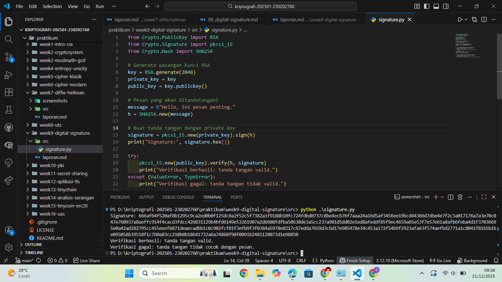

# Laporan Praktikum Kriptografi
Minggu ke-: 9  
Topik: Digital Signature (RSA/DSA)  
Nama: Julian Aji Pratama  
NIM: 230202760  
Kelas: 5IKRB  

---

## 1. Tujuan
1. Mengimplementasikan tanda tangan digital menggunakan algoritma RSA/DSA.  
2. Memverifikasi keaslian tanda tangan digital.  
3. Menjelaskan manfaat tanda tangan digital dalam otentikasi pesan dan integritas data.  

---

## 2. Dasar Teori
Tanda tangan digital merupakan mekanisme kriptografi yang digunakan untuk memastikan bahwa suatu pesan benar-benar berasal dari pengirim yang sah dan tidak mengalami perubahan selama transmisi. Tanda tangan digital biasanya dibangun menggunakan algoritma kriptografi kunci publik seperti RSA atau DSA.

Pada tanda tangan digital RSA, proses penandatanganan dilakukan menggunakan private key, sedangkan proses verifikasi dilakukan menggunakan public key. Berbeda dengan enkripsi yang bertujuan menjaga kerahasiaan pesan, tanda tangan digital berfokus pada integritas data, otentikasi pengirim, dan non-repudiation (pengirim tidak dapat menyangkal pesan yang telah ditandatangani).

---

## 3. Alat dan Bahan
- Python 3.12.10  
- Visual Studio Code / editor lain  
- Git dan akun GitHub  
- Library tambahan (pycryptodome)

---

## 4. Langkah Percobaan
(Tuliskan langkah yang dilakukan sesuai instruksi.  
Contoh format:
1. Membuat file `signature.py` di folder `praktikum/week9-digital-signature/src/`.
2. Menyalin kode program dari panduan praktikum.
3. Menjalankan program dengan perintah `python signature.py`.)

---

## 5. Source Code
(Salin kode program utama yang dibuat atau dimodifikasi.  
Gunakan blok kode:

```python
from Crypto.PublicKey import RSA
from Crypto.Signature import pkcs1_15
from Crypto.Hash import SHA256

# Generate pasangan kunci RSA
key = RSA.generate(2048)
private_key = key
public_key = key.publickey()

# Pesan yang akan ditandatangani
message = b"Hello, ini pesan penting."
h = SHA256.new(message)

# Buat tanda tangan dengan private key
signature = pkcs1_15.new(private_key).sign(h)
print("Signature:", signature.hex())

try:
    pkcs1_15.new(public_key).verify(h, signature)
    print("Verifikasi berhasil: tanda tangan valid.")
except (ValueError, TypeError):
    print("Verifikasi gagal: tanda tangan tidak valid.")

    # Modifikasi pesan
fake_message = b"Hello, ini pesan palsu."
h_fake = SHA256.new(fake_message)

try:
    pkcs1_15.new(public_key).verify(h_fake, signature)
    print("Verifikasi berhasil (seharusnya gagal).")
except (ValueError, TypeError):
    print("Verifikasi gagal: tanda tangan tidak cocok dengan pesan.")
```
)

---

## 6. Hasil dan Pembahasan
(- Lampirkan screenshot hasil eksekusi program (taruh di folder `screenshots/`).  
- Berikan tabel atau ringkasan hasil uji jika diperlukan.  
- Jelaskan apakah hasil sesuai ekspektasi.  
- Bahas error (jika ada) dan solusinya. 

Hasil eksekusi program Caesar Cipher:


)

---

## 7. Jawaban Pertanyaan
- Pertanyaan 1: Apa perbedaan utama antara enkripsi RSA dan tanda tangan digital RSA?  
  Enkripsi RSA menggunakan public key untuk menjaga kerahasiaan pesan, sedangkan tanda tangan digital RSA menggunakan private key untuk menjamin keaslian dan integritas pesan.
- Pertanyaan 2: Mengapa tanda tangan digital menjamin integritas dan otentikasi pesan?  
  Karena tanda tangan dibuat berdasarkan hash pesan dan private key pengirim. Jika pesan diubah, hasil hash akan berbeda dan verifikasi akan gagal.
- Pertanyaan 3: Bagaimana peran Certificate Authority (CA) dalam sistem tanda tangan digital modern?  
  CA berperan untuk memverifikasi identitas pemilik public key dan menerbitkan sertifikat digital, sehingga public key yang digunakan dapat dipercaya.

---

## 8. Kesimpulan
Praktikum ini membuktikan bahwa tanda tangan digital RSA dapat menjamin integritas dan otentikasi pesan. Perubahan sekecil apa pun pada pesan akan menyebabkan proses verifikasi gagal. Oleh karena itu, tanda tangan digital sangat penting dalam sistem keamanan modern.

---

## 9. Daftar Pustaka
(Cantumkan referensi yang digunakan.  
Contoh:  
- Katz, J., & Lindell, Y. *Introduction to Modern Cryptography*.  
- Stallings, W. *Cryptography and Network Security*.  )

---

## 10. Commit Log
```
commit 510702013d02efb74d7630c6a3a60a36511e46cf (HEAD -> main, origin/main, origin/HEAD)
Author: julian-ajipratama <julianap28072005@gmail.com>
Date:   Sun Dec 21 10:02:52 2025 +0700

    week9-digital-signature
```